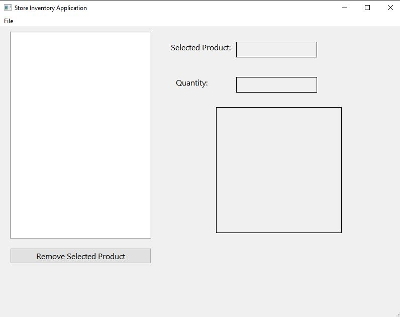
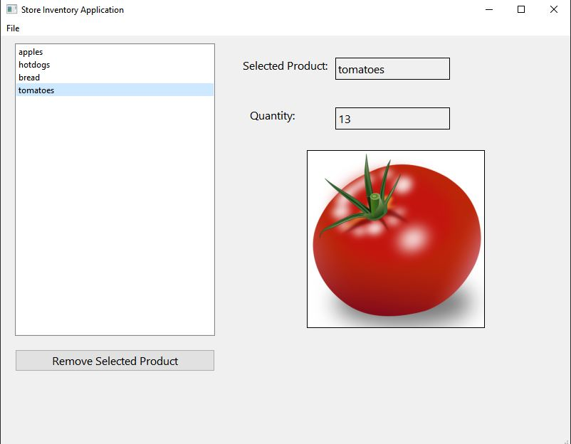
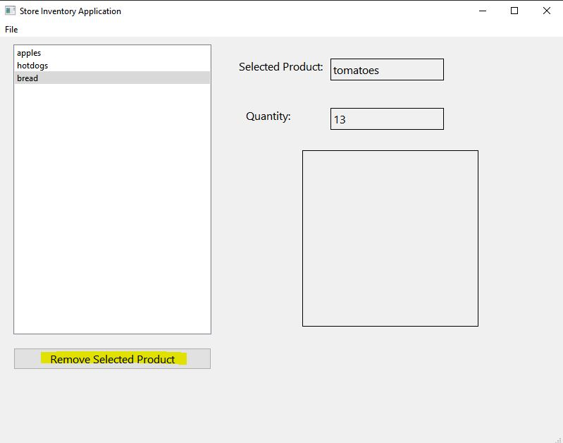
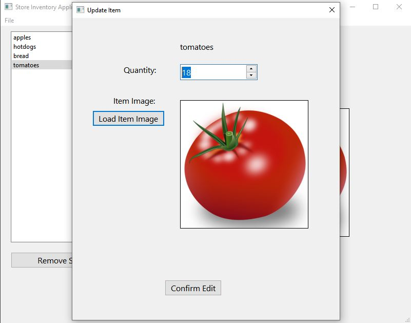
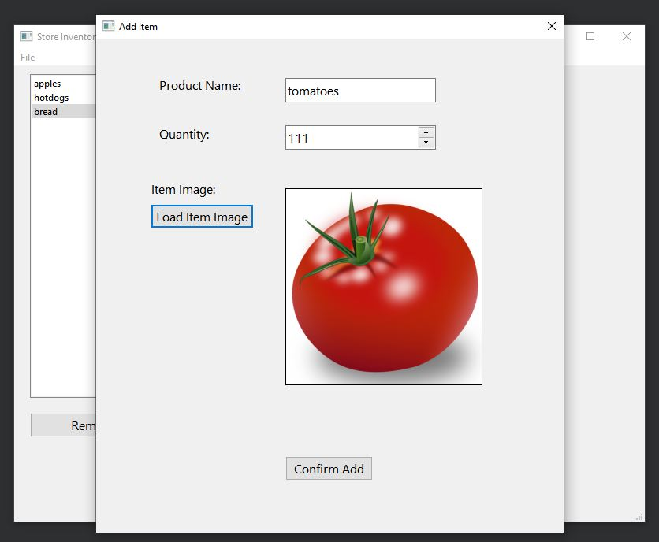

# StoreInventoryApp
Simple Store inventory application using C++ and Qt Creator

Upon running the project in Qt Creator, the user will see the "Store Inventory Application" dialog box which is the main window for the application. (Shown below)

From here, the user can select the following options from the "File" tab located in the top-left of the dialog box:
- New Product
- Edit Selected Product
- Save Products
- Load Products
----
If there are no saved products from previous uses of the application, the user can only select "New Product" to add new items to our list.

If there are saved products from previous uses of the application, the user can select "Load Products" to load a list of previously saved items(shown below).
These items along with their quantities and image file paths are saved in a file called "products.txt", which is located in build folder for the application.

The user can then select an item from the list(shown above) and either remove the selected product by clicking the "Remove Selected Product" button below the list, OR the user can edit the selected product by clicking on the File tab and then clicking "Edit Selected Product".

**Removing a selected product:**

**Editing a selected product:**

After editing the selected item, the "Update Item" dialog box will appear. The user can then change the quantity or the item image. Clicking the button "Confirm Edit" will then save the changes in the list of products located in the "Store Inventory Application" dialog box.

----

**Adding an Item:**

By clicking File->New Product, the "Add Item" dialog box will appear. Here the user can enter the product name, desired quantity and add an image for the item. The images are located in an "images" folder which is in the build folder for the application. By clicking the "Confirm Add" button at the bottom, the list in the "Store Inventory Application" dialog box will be updated with the new item.

----

**Saving the Product List:**

By clicking File->Save Products, the current list of items will be saved in the "products.txt" file to be used for future use. Clicking File->Load Products, will load the previously saved list of items.
